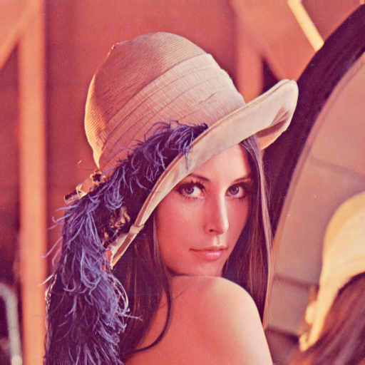
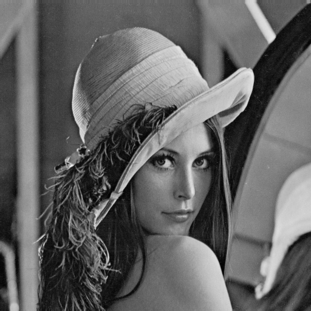
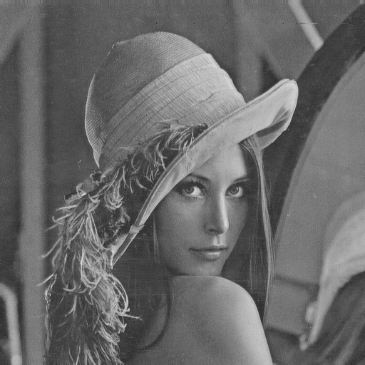
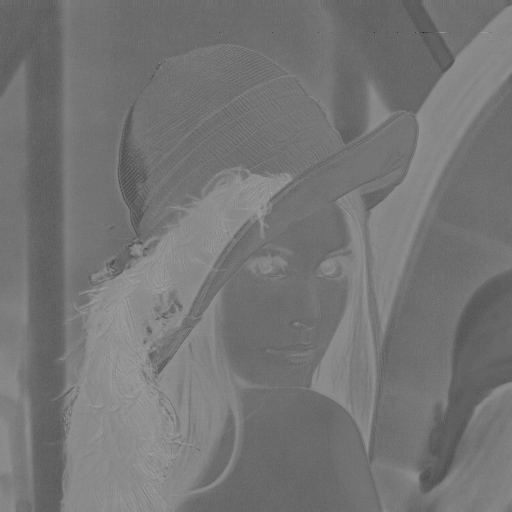
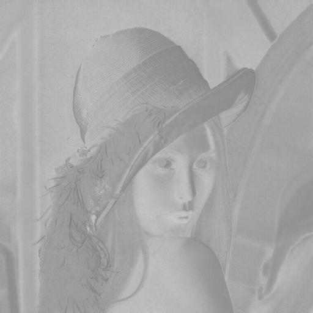
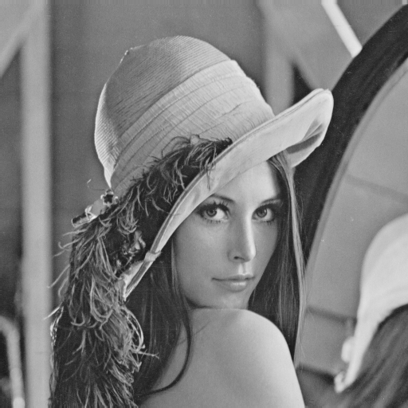

# Video Compression Homework 1 Report

**Student ID:** [314554025]  
**Name:** [鄭睿宏]  
**Date:** 2025-09-24

## Objective

This assignment aims to explore color space transformations using a given image (`lena.png`). The task includes:

- Converting the image from RGB to:
  - YUV color space
  - YCbCr color space
- Generating grayscale images of the individual channels:
  - RGB → R, G, B
  - YUV → Y, U, V
  - YCbCr → Y, Cb, Cr

All transformations are done manually using the provided formulas without using any built-in color conversion functions.

---

## Input Example: lena.png

*Input Figure: lena.png*

## 1. RGB Components

> Due to OpenCV's default image reader setting being BGR, a BGR-to-RGB conversion is required for convenience before further processing.

Each color channel (R, G, B) was extracted and saved as a grayscale image.

  
*Figure 1: Red Channel*

  
*Figure 2: Green Channel*

  
*Figure 3: Blue Channel*

---

## 2. YUV Transformation

The RGB to YUV transformation uses the following formulas:

$\begin{aligned}
Y &= 0.299 \cdot R + 0.587 \cdot G + 0.114 \cdot B \\
U &= -0.169 \cdot R - 0.331 \cdot G + 0.5 \cdot B + 128 \\
V &= 0.5 \cdot R - 0.419 \cdot G - 0.081 \cdot B + 128 \\
\end{aligned}$

  
*Figure 4: Y Channel (YUV)*

  
*Figure 5: U Channel (YUV)*

  
*Figure 6: V Channel (YUV)*

---

## 3. YCbCr Transformation

The RGB to YCbCr transformation uses the following formulas:

$\begin{aligned}
Y &= 0.299 \cdot R + 0.587 \cdot G + 0.114 \cdot B \\
Cb &= -0.168736 \cdot R - 0.331264 \cdot G + 0.5 \cdot B + 128 \\
Cr &= 0.5 \cdot R - 0.418688 \cdot G - 0.081312 \cdot B + 128 \\
\end{aligned}$
  
*Figure 7: Y Channel (YCbCr)*

  
*Figure 8: Cb Channel (YCbCr)*

  
*Figure 9: Cr Channel (YCbCr)*

---

## 4. Implementation Notes

The project dependencies can be managed either through a `requirements.txt` file or by using `uv` (ref: **README.md**).

For the implementation, I implemented with "native-python" (readable) and "NumPy" (fast) version:

**main.py**: 
- implemented in native Python with clear and readable logic.

**numpy_main.py**: 
- implemented using NumPy arrays to achieve accelerated computation.

---

## 5. Conclusion

This assignment demonstrates manual implementation of **RGB** to **YUV** and **YCbCr** transformations and visualization of each color channel. Understanding the transformation formulas helps reinforce how image data is represented and manipulated in different color spaces.

