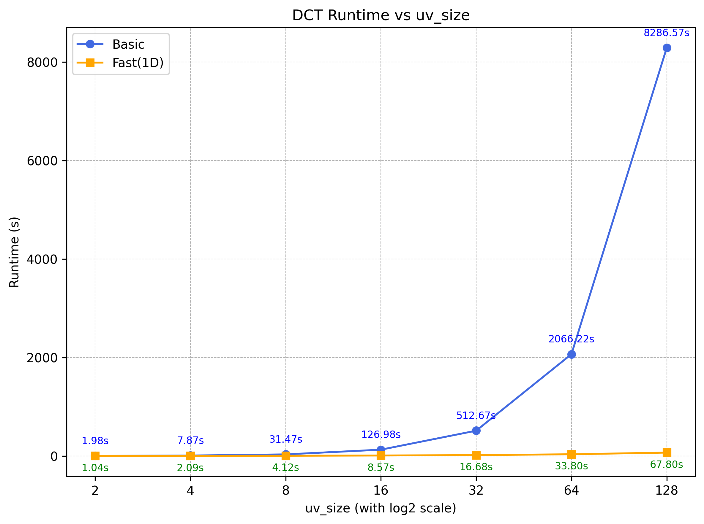
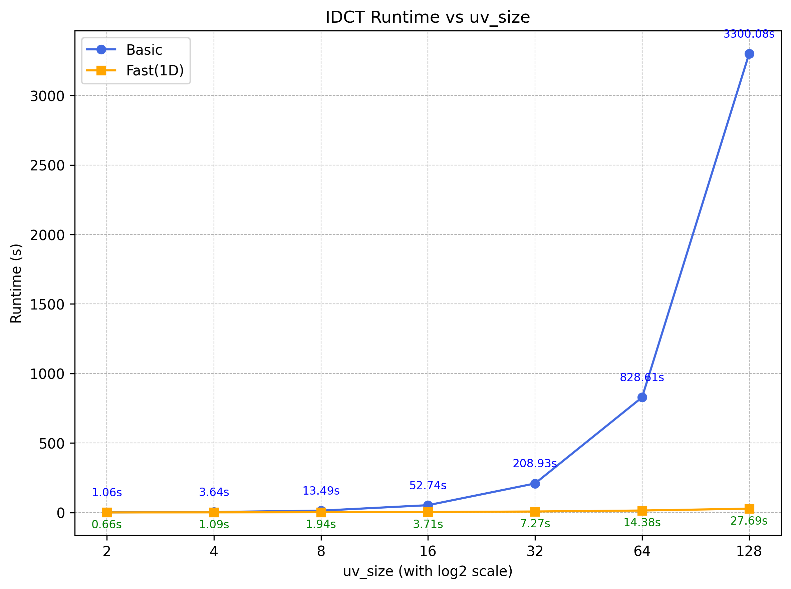
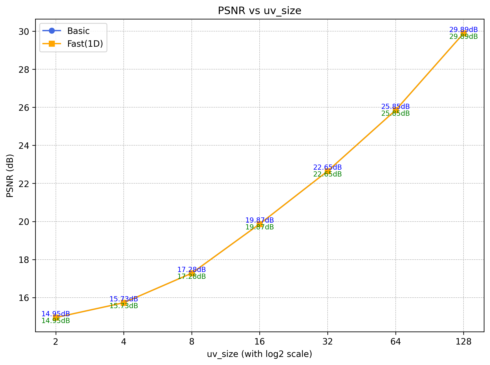

# Video Compression HW2 – DCT Report
**Name:** 鄭睿宏 314554025 

#### 1. Introduction

I implemented both `2D-DCT` and `two 1D-DCT` approach, and use `PSNR` as evaluation metric.
DCT can transform image into frequency domain and reconstruct image by inverse transform (IDCT). 
User can compress image by **discarding high-frequency coefficients** that contribute less to visual perception. This allows for reduction in storage or transmission size with minimal perceptual loss.

#### 2. Computational Complexity Analysis

The computational efficiency of **2D-DCT** and the **two 1D-DCT (accelerated)** approach differs significantly due to the separability property of DCT.

For a square image of size \(N \times N\), the **direct 2D-DCT** computes each frequency coefficient \(F(u,v)\) using the double summation over all pixels:

\[
F(u,v) = \alpha(u)\alpha(v) \sum_{x=0}^{N-1} \sum_{y=0}^{N-1} f(x,y) \cos\frac{(2x+1)u\pi}{2N} \cos\frac{(2y+1)v\pi}{2N}
\]

This requires \(O(N^2)\) operations for each of the \(N^2\) coefficients, resulting in a total time complexity of:

\[
O(N^2 \cdot N^2) = O(N^4)
\]

On the other hand, the **two 1D-DCT** approach leverages DCT’s separability by first applying 1D-DCT along each row and then along each column. Each 1D-DCT on a row or column of length \(N\) requires \(O(N^2)\) operations, and with \(N\) rows and \(N\) columns, the total complexity becomes:

\[
O(N^3 + N^3) = O(2N^3) \approx O(N^3)
\]

| Method          | Time Complexity | Notes |
|-----------------|----------------|-------|
| 2D-DCT (direct) | \(O(N^4)\)     | Simple but computationally expensive for large images |
| Two 1D-DCT      | \(O(N^3)\)     | Faster due to separability; produces identical results |

Thus, for large images or real-time applications, the **two 1D-DCT method is significantly more efficient**, while maintaining the same accuracy as the full 2D-DCT.

---

#### 3. Results
- Grayscale Lena

- DCT Coefficients (Log Domain)

- Reconstructed Image (Using IDCT)

---
#### 4. Runtime & PSNR Comparision (2D-DCT vs. two 1D-DCT)
##### DCT Runtime (2D-DCT & two 1D-DCT)

- The **computational complexity** of the 2D-DCT is \( O(N^2 \times N^2) = O(N^4) \), since it directly computes the transform over both spatial dimensions simultaneously.  
- In contrast, the **two 1D-DCT** approach applies one-dimensional DCT operations sequentially along rows and columns, reducing the complexity to \( O(2 \times N^3) \).  
- As a result, when the DCT size (`u_size`, `v_size`) doubles,  
    - the runtime of **2D-DCT** grows approximately **4×**,  
    - while the runtime of **two 1D-DCT** grows only about **2×**.  
- From the figure, it is evident that two 1D-DCT achieves a significant speed-up as the block size increases, demonstrating its computational advantage in practice.

##### IDCT Runtime (2D-DCT & two 1D-DCT)

- A similar trend can be observed for the inverse transform (IDCT).  
- The **2D-IDCT** runtime scales quadratically with image size, while the **two 1D-IDCT** scales linearly with each dimension.  
- This property makes the two 1D-IDCT more scalable and efficient for larger image sizes.

##### PSNR (2D-DCT & two 1D-DCT)

- Both methods theoretically produce identical reconstructed images, leading to nearly identical **PSNR** values.  
- Minor discrepancies arise from floating-point rounding and computation order differences.  
- Overall, the two 1D-DCT achieves the same reconstruction quality while greatly reducing computation time, confirming it as the more efficient implementation.

---

#### 5. Observation: Effect of DCT Compression
- It can be observed that when using DCT for compression, the transform tends to **discard fine details** while still **preserving the main structural features** of the image.  
- As the `uv_size` increases, more frequency components are retained, leading to higher-quality reconstruction.

##### Reconstructed Images at Different UV Sizes
- `uv_size = 64`

- `uv_size = 128`

- `uv_size = 512`

