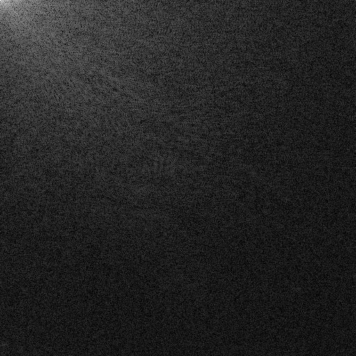

# Video Compression HW2 – DCT Report
**Name:** 鄭睿宏  
**Student ID:** 314554025 
**Assignment:** 2D-DCT and Two 1D-DCT Implementation on “lena.png”

---

## 1. Introduction

In this homework, I implemented both the `2D Discrete Cosine Transform (2D-DCT)` and the `two 1D-DCT (accelerated)` approach, and use `Peak Signal-to-Noise Ratio (PSNR)` as the evaluation metric.
DCT can transform an image into the frequency domain and reconstruct the image through the inverse transform (IDCT), User can compressed the image **by discarding high-frequency coefficients** that contribute less to visual perception. This allows for reduction in storage or transmission size with minimal perceptual loss.

---

### 2. Computational Complexity Analysis

The computational efficiency of **2D-DCT** and the **two 1D-DCT (accelerated)** approach differs significantly due to the separability property of DCT.

For a square image of size \(N \times N\), the **direct 2D-DCT** computes each frequency coefficient \(F(u,v)\) using the double summation over all pixels:

\[
F(u,v) = \alpha(u)\alpha(v) \sum_{x=0}^{N-1} \sum_{y=0}^{N-1} f(x,y) \cos\frac{(2x+1)u\pi}{2N} \cos\frac{(2y+1)v\pi}{2N}
\]

This requires \(O(N^2)\) operations for each of the \(N^2\) coefficients, resulting in a total time complexity of:

\[
O(N^2 \cdot N^2) = O(N^4)
\]

On the other hand, the **two 1D-DCT** approach leverages DCT’s separability by first applying 1D-DCT along each row and then along each column. Each 1D-DCT on a row or column of length \(N\) requires \(O(N^2)\) operations, and with \(N\) rows and \(N\) columns, the total complexity becomes:

\[
O(N^3 + N^3) = O(2N^3) \approx O(N^3)
\]

| Method          | Time Complexity | Notes |
|-----------------|----------------|-------|
| 2D-DCT (direct) | \(O(N^4)\)     | Simple but computationally expensive for large images |
| Two 1D-DCT      | \(O(N^3)\)     | Faster due to separability; produces identical results |

Thus, for large images or real-time applications, the **two 1D-DCT method is significantly more efficient**, while maintaining the same accuracy as the full 2D-DCT.

---

## 3. Results
### Grayscale Lena

### DCT Coefficients (Log Domain)

### Reconstructed Image (Using IDCT)

---
## 4. Run time and PSNR Comparision
### 2D-DCT Run-time

### two 1D-DCT Run-time

### 2D-DCT PSNR

### two 1D-DCT PSNR
