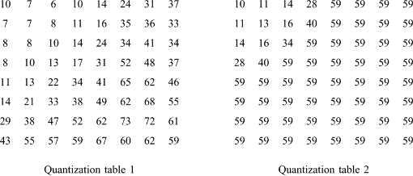
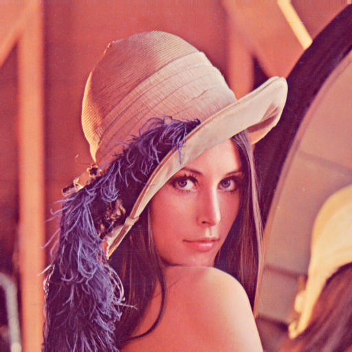
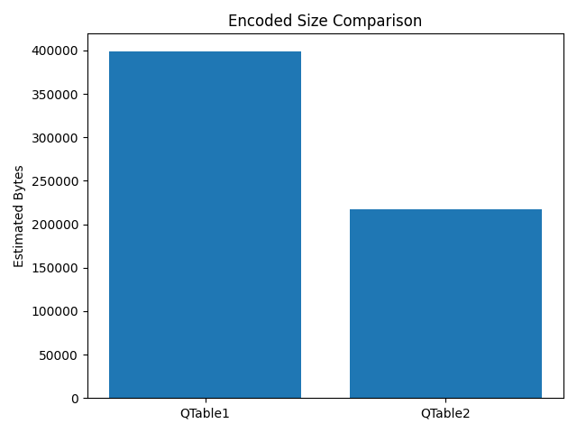

## HW4: JPEG-like Compression with RLE and DCT

**Student ID:** [314554025]
**Name:** [鄭睿宏]
**Project Link:** [https://github.com/RyanCheng98153/video-compression/tree/main/hw4](https://github.com/RyanCheng98153/video-compression/tree/main/hw4)

---

### 1. Introduction

In this homework, I implemented **block-based 8×8 DCT compression** with **quantization**, **zigzag scan**, and **run-length encoding (RLE)**. The reconstructed image is obtained through **run-length decoding** and **inverse DCT (IDCT)**.

Two quantization tables (QTable1 and QTable2) are provided, and the effect on **encoded size** and **reconstruction quality (PSNR)** is compared.

This homework demonstrates the **core JPEG compression workflow** and evaluates how different quantization tables influence compression performance.

---

### 2. Methodology

#### 2.1 Block-based DCT

The input image (`lena.png`) is divided into $(8 \times 8)$ blocks. For each block, the **Discrete Cosine Transform (DCT)** is computed:
\[
F(u,v) = \sum_{x=0}^{7} \sum_{y=0}^{7} \alpha(u)\,\alpha(v)\, f(x,y) \cos\frac{(2x+1)u\pi}{16} \cos\frac{(2y+1)v\pi}{16},
\]

where 

\[
\alpha(u) = \frac{1}{\sqrt{2}} \text{ if } u=0, \text{ else } 1, \quad
\alpha(v) = \frac{1}{\sqrt{2}} \text{ if } v=0, \text{ else } 1.
\]

#### 2.2 Quantization

Each DCT coefficient is divided by its corresponding **quantization table value** and rounded to integers:

\[
C_q(u,v) = \text{round}\left( \frac{C(u,v)}{Q(u,v)} \right)
\]

This reduces precision and introduces **loss**, enabling higher compression.

#### 2.3 Zigzag Scan & Run-Length Encoding

* **Zigzag scan** converts the 8×8 block into a 1D vector, visiting coefficients from low to high frequency.
* **Run-length encoding (RLE)** compresses sequences of zeros efficiently. Each block is encoded as tuples `(run, value)` until an **End-of-Block (EOB)** marker:

```
Example: [(0,52), (0,3), (5,2), ("EOB",)]
```

#### 2.4 Decoding & Reconstruction

* RLE is decoded to reconstruct the zigzag vector, then converted back to 8×8 blocks.
* **Dequantization** multiplies the coefficients by the original quantization table.
* **Inverse DCT (IDCT)** reconstructs the spatial-domain image.
* Blocks are merged to obtain the final reconstructed image.
---

### 3. Results

#### 3.1 Original Image (Lena.png)


<!-- Page break -->
<div style="break-after: page; page-break-after: always;"></div>

#### 3.2 Quantization Tables

* **QTable1**: More fine-grained for low-frequency preservation.
* **QTable2**: Coarser, prioritizing higher compression.

- **Q-Tables**
    

#### 3.3 Reconstructed Images

<div style="display: flex; justify-content: space-around; align-items: center;">
  <div style="text-align: center;">
    <p><b>QTable1 Reconstructed Image</b></p>
    
  </div>
  <div style="text-align: center;">
    <p><b>QTable2 Reconstructed Image</b></p>
    
  </div>
</div>


#### 3.4 Compression Statistics

| Quantization Table | Estimated Bytes | PSNR (dB) |
| ------------------ | --------------- | --------- |
| QTable1            | 399,342         | 35.87     |
| QTable2            | 216,900         | 33.38     |


<!-- Page break -->
<div style="break-after: page; page-break-after: always;"></div>

**Bar Plot: Encoded Size Comparison**



---


### 4. Observations

* **Effect of Quantization Table:**

  * QTable1 retains more low-frequency information → higher PSNR, larger encoded size.
  * QTable2 aggressively quantizes coefficients → smaller encoded size, lower PSNR.

* **Compression Efficiency:**
  Run-length encoding effectively reduces consecutive zeros in high-frequency coefficients.
  Coarser quantization (QTable2) increases zero sequences, improving RLE efficiency.

* **Image Quality vs Compression:**
  There is a trade-off between compression ratio and visual quality, as indicated by PSNR.

* **Comparison Between QTables:**

  * **Encoded Image Size:** QTable2 achieves ~46% smaller size than QTable1.
  * **PSNR:** QTable1 maintains ~2.5 dB higher reconstruction quality than QTable2.
    This illustrates the trade-off between compression efficiency and visual quality.

---

### 5. Conclusion

* Block-based DCT combined with **quantization** and **RLE** provides a simple JPEG-like compression scheme.
* Different quantization tables strongly influence **encoded size** and **reconstruction quality**.
* QTable1 is better for preserving quality, while QTable2 achieves higher compression.
* This homework demonstrates the fundamental steps of **lossy image compression** using DCT and entropy coding.

---

#### References

1. JPEG Quantization & DCT: [https://www.youtube.com/watch?v=Q2aEzeMDHMA](https://www.youtube.com/watch?v=Q2aEzeMDHMA)
2. Run-Length Encoding Tutorial: [https://q-viper.github.io/2021/05/24/coding-run-length-encoding-in-python/](https://q-viper.github.io/2021/05/24/coding-run-length-encoding-in-python/)
